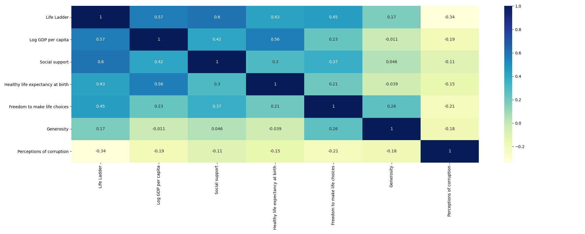
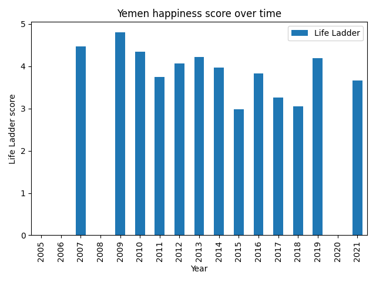
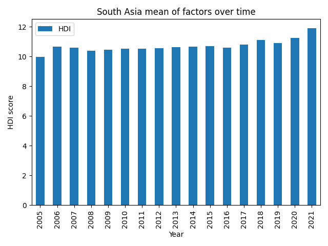
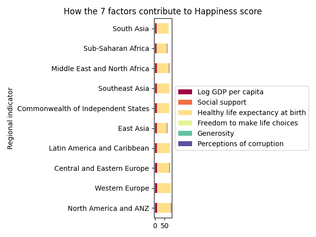
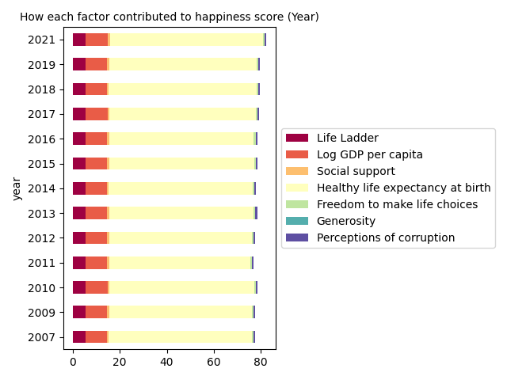

# BOS Challenge
This project contains a simple python application designed as a response to BOS interview challenge

## Contents
1. Install requirements
2. Run project
3. What kind of reports generate

#### Install requirements
Before running the project you should install required packages as follow:
```shell script
virtualenv -p python3 venv
source venv/bin/activate
pip install -r requirements.txt
```

#### Run project
In order to run the project just act as bellow:
```shell script
python challenge.py
```

#### What kind of reports generate
The project read data provided in [Dataset](Datasets) folder. After reading each file, it perform some preprocessing on data 
in order to make them proper for further processing. After preparing each bunch of data, they will merge to each other to 
provide a single World Happiness data.

There are provided five functions in order to generate useful reports from prepared data.

##### 1. Heat map
[generate_data_heat_map](analysis.py) to examine possible happiness factors co-relations. Based on this graph we decide which
factors we should use for further processing. From the heat map, it is pretty evident that most of the data fields have a strong relation between them.



##### 2. Yearly variations of happiness factors
[extract_yearly_variations_of_happiness](analysis.py) to calculate and generate report about world happiness over years in a selected region or country. This function also generate chart from resulting data. 
In order to use this function you should determine factor with country or region title. You can find usage example in [challenge.py](challenge.py) file. Following chart is generated by this function for the 
country of Yemen based on Life Ladder factor.



##### 3. Average of hapiness scores (HDI)
[calculate_average_happiness_score](analysis.py) to calculate average happiness score for a defined region or country. Following Chart is generated by this function.



##### 4. Happiness factors impact
[plot_factor_responsibility_for_happiness_region](analysis.py) to calculate each factor responsibility for the happiness score according to each region.
Among all the happiness determining attributes, health life expectancy has the most recorded weightage.



[plot_factor_responsibility_for_happiness_rate_over_years](analysis.py) to calculate each factor responsibility for the happiness score over years.
Among all the happiness determining attributes, health life expectancy has the most recorded weightage.


